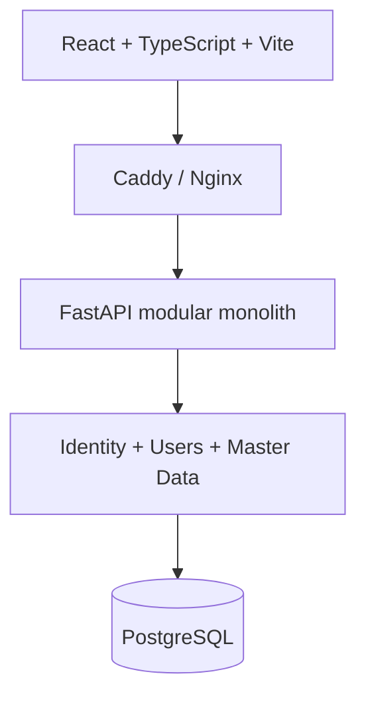

# FlowStock

**Inventory and operations SaaS — an incremental software engineering case.**

Python · FastAPI · React · TypeScript · PostgreSQL · Docker

> **Current status:** Engineering Foundation, Identity/Security and Master Data are implemented. Inventory, purchasing, sales, dashboards and production/pilot remain planned.

## Overview

FlowStock explores a practical engineering question: how can an operations product evolve beyond CRUD without losing security, traceability or delivery discipline?

This public snapshot contains the demonstrable technical core: a FastAPI modular monolith, a React SPA, PostgreSQL, containerized environments, automated quality gates and curated public engineering notes. It intentionally excludes private product strategy, internal governance, planning, risk and operational records.

## Problem

Inventory is not only a quantity. Operational confidence also depends on identity, authorization, history, protected data and the ability to verify that each change produced a consistent result.

## Incremental solution

| Increment | Scope | Status |
| --- | --- | --- |
| Sprint 0 | Engineering foundation | Implemented |
| Sprint 1 | Identity, authentication and security | Implemented |
| Sprint 2 | Master data | Implemented |
| Sprint 3 | Inventory | Planned |
| Sprint 4 | Purchasing | Planned |
| Sprint 5 | Sales | Planned |
| Sprint 6 | Dashboards | Planned |
| Sprint 7 | Production and pilot | Planned |

## Architecture



Cross-cutting controls include authentication, server-side RBAC, audit events, correlation IDs, structured logs, metrics, security headers and optional OpenTelemetry export. See [Public architecture](docs/architecture.md).

## Implemented capabilities

### Identity and access

- login, logout and password change;
- Administrator-assisted recovery;
- Administrator, Manager and Cashier roles;
- server-side permissions and immediate session revocation;
- user creation, editing, role changes and activation/deactivation.

### Master data

- categories with one optional parent level;
- seeded and manageable units of measure;
- products with SKU, optional barcode, category, unit, cost/sale prices in minor units and minimum stock;
- individual and company customers;
- paginated search, sorting and logical activation/deactivation;
- responsive UI for the implemented resources.

## Engineering highlights

- strict mypy and TypeScript checks;
- Ruff, ESLint and Prettier quality gates;
- backend and frontend automated tests;
- an 80% backend coverage threshold;
- locked dependencies and dependency audits;
- multi-stage, non-root container images;
- read-only filesystems and `no-new-privileges` in Compose;
- Trivy image scanning and SPDX SBOM generation in CI;
- curated architecture, security, testing and observability documentation.

## Security

- Argon2id password hashing;
- opaque PostgreSQL sessions stored by keyed hash;
- idle and absolute session expiration;
- CSRF protection for authenticated mutations;
- trusted-host, CORS and security-header middleware;
- encrypted and masked customer documents;
- audit events for identity, user management and master-data operations.

See [Security model](docs/security.md) and [security reporting](SECURITY.md).

## Testing and quality

The public snapshot reproduced:

- backend: **24 tests passed**, **84.97% coverage**;
- frontend: **22 tests passed across 9 files**, **96.2% statement coverage**.

Formatting, linting, type checking, dependency audits and production builds also pass. Full evidence and scope are recorded in [Quality and validation](docs/quality.md).

```powershell
./quality/check.ps1
```

## Observability

- liveness and readiness endpoints;
- Prometheus request metrics;
- structured application logs;
- request correlation IDs;
- optional OpenTelemetry export;
- local Prometheus and Grafana profiles.

See [Observability](docs/observability.md).

## Tech stack

| Area | Technologies |
| --- | --- |
| Backend | Python 3.12, FastAPI, SQLAlchemy, Alembic, Pydantic |
| Frontend | React, TypeScript, Vite, TanStack Query |
| Data | PostgreSQL |
| Security | Argon2id, opaque sessions, CSRF, RBAC, Fernet |
| Quality | pytest, coverage.py, Vitest, Ruff, mypy, ESLint, Prettier |
| Platform | Docker, Docker Compose, Caddy, Nginx, GitHub Actions |
| Observability | Prometheus, Grafana, structlog, OpenTelemetry |
| Supply chain | pip-audit, pnpm audit, Trivy, SPDX SBOM |

## Product vision and implementation boundary

Concept demonstrations may explore future product capabilities, but they are not evidence of implemented behavior. This repository, its source code and its automated validation are the source of truth for the capabilities currently available.

Dashboards, inventory operations, purchasing, sales and later product milestones remain planned unless explicitly identified as implemented in this repository.

## Public project structure

```text
apps/api              FastAPI application, migrations and tests
apps/web              React application and tests
packages              Shared package boundaries
deployment/docker     Containers and Compose
deployment/observability
docs                  Curated public engineering documentation
quality               Local validation entry point
```

## Running locally

Requirements:

- Docker Engine with Docker Compose v2;
- PowerShell only if using the local quality script.

```powershell
Copy-Item .env.example .env
# Replace every placeholder in .env
docker compose --env-file .env -f deployment/docker/compose.yaml up --build -d
```

The edge is available at `http://localhost:8080`. Migrations run when the API container starts.

```text
GET /api/v1/health/live
GET /api/v1/health/ready
GET /metrics
```

Create the first Administrator interactively:

```powershell
docker compose --env-file .env -f deployment/docker/compose.yaml exec api python -m flowstock_api.modules.identity.bootstrap --email admin@example.com --name "Administrator"
```

## Engineering decisions

The curated ADRs explain the [modular monolith](docs/decisions/001-modular-monolith.md), [opaque sessions and server-side authorization](docs/decisions/002-identity-and-access.md), and [container and supply-chain controls](docs/decisions/003-container-supply-chain.md).

## Roadmap

The roadmap is intentionally incremental. Planned capabilities are never presented as implemented. The next product milestone is **Sprint 3 — Inventory**.

See [Public roadmap](docs/roadmap.md).

## Status

FlowStock is under active development. This repository is an engineering snapshot, not a production claim and not evidence of active customers or users.

## Usage and rights

This repository is shared for portfolio demonstration and technical evaluation. No open-source license is granted; copying, modifying, redistributing or sublicensing the code requires prior permission.
